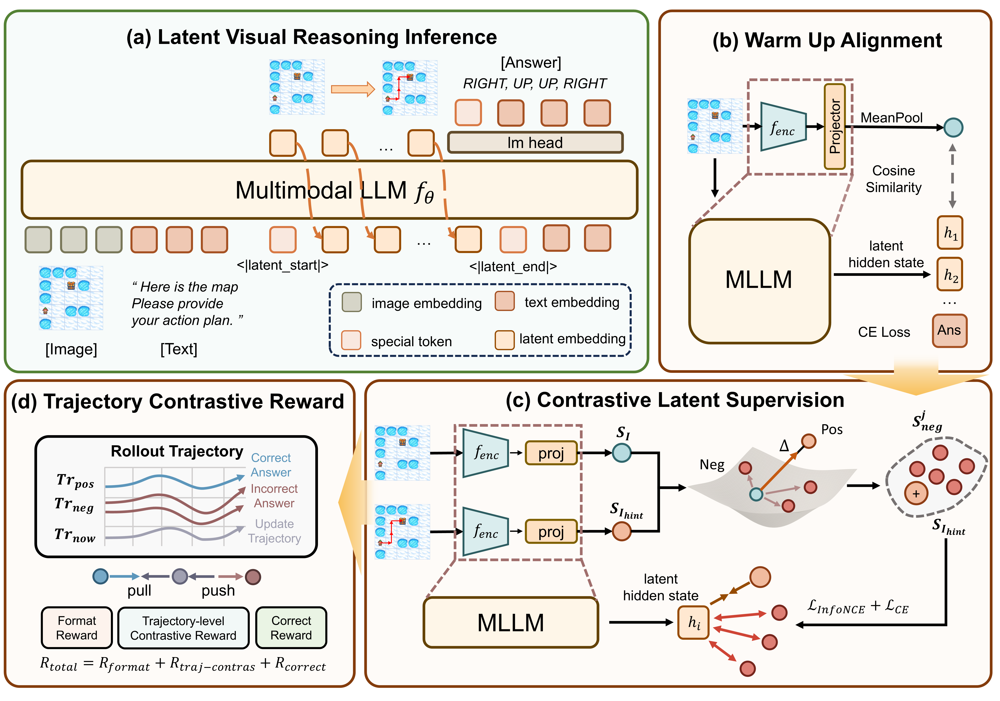

<p align="center">
	<h1 align="center">CoLVR: Enhancing Exploratory Latent Visual Reasoning via Contrastive Optimization </h1>
	<p align="center">
	</p>
    <p align="center">
      <!---<b>Ziyang Ding, Linjian Meng, Yiming Wu, Yuhan Li, Yuhao Liu, Zhen Zhao<sup>†</sup></b>--->
      <p align="center">
        <a href="https://scholar.google.com/citations?user=SuFIjWQAAAAJ&hl=zh-CN/">Ziyang Ding</a>,
        <a href="https://menglinjian.github.io//">Linjian Meng</a>,
        <a href="https://sites.google.com/site/yimingwu0/home/">Yiming Wu</a>,
        <a href="https://github.com/YuhanLeeeee">Yuhan Li</a>,
        <a href="https://yiqian7a.github.io/">Yuhao Liu</a>,
        <a href="http://zhaozhen.me/">Zhen Zhao<sup>†</sup></a>,
      </p>
    </p>
    <p align="center">
        <a href="http://arxiv.org/abs/"></a>
        <a href="https://huggingface.co/Oscar-dzy/CoLVR-VSP" target="_blank" rel="noopener noreferrer"></a>
        <a href="https://huggingface.co" target="_blank" rel="noopener noreferrer"></a>
<p align="center">
    
</p>


we propose **CoLVR** (**C**ontrastive **O**ptimization for **L**atent **V**isual **R**easoning), a latent contrastive training framework toward more flexible and exploratory visual reasoning. CoLVR optimizes relative contrastive relationships among latent visual states, thereby preserving the freedom of latent exploration while still providing task-relevant supervision.


## :fire: News
* **[2026.05.12]**  Our paper is now available on ArXiv.
* **[2026.05.10]**  We released the inference code, as well as the model checkpoints and VSP Benchmark on Hugging Face (Training code and training datasets will be released upon paper acceptance). 


## :clipboard: Abstruct

Due to the potential for exploratory reasoning of Latent Visual Reasoning, recent works tend to enable MLLMs (Multimodal Large Language Models) to perform visual reasoning by propagating continuous hidden states instead of decoding intermediate steps into discrete tokens. However, existing works typically rely on **hard alignment** objectives to force latent representations to match predefined visual features, thereby severely limiting the exploratory of latent reasoning process. To address this problem, we propose **CoLVR** (**C**ontrastive **O**ptimization for **L**atent **V**isual **R**easoning). To obtain a more **exploratory visual reasoning**, CoLVR introduces a latent contrastive training framework. Firstly, CoLVR learns diverse and exploratory representations with a latent contrastive objective guided by angle-based perturbation, which expands the semantic latent space and avoids over-constrained embedding. Then, CoLVR employs a latent trajectory contrastive reward for RL (Reinforcement Learning) post-training to enable fine-grained optimization of latent visual reasoning process and thus fostering diverse reasoning behaviors. Experiments demonstrate that \ours{} significantly enhances the exploratory capability of latent representations, achieving average improvements of 5.83% on VSP and 8.00% on Jigsaw, while also outperforming existing latent models on out of domain benchmarks, with a 3.40% gain on MMStar.


## :mag_right: Overview
<details open="open" style='padding: 10px; border-radius:5px 30px 30px 5px; border-style: solid; border-width: 0px;'>
  <summary>Tabel of Contents</summary>
  <ol>
    <li>
      <a href="#microscope-environment">Environment</a>
    </li>
    <li>
      <a href="#books-data-preparation">Data Preparation</a>
    </li>
    <li>
      <a href="#package-checkpoints">Checkpoints</a>
    </li>
    <li>
      <a href="#rocket-inference">Inference</a>
    </li>
    <li>
      <a href="#pen-citation">Citation</a>
    </li>
    <li>
      <a href="#pray-acknowledgement">Acknowledgement</a>
    </li>
  </ol>
</details>


## :microscope: Environment

You can run the following command according to the evaluation environment:

```
conda create -n colvr_eval python==3.10
conda activate colvr_eval

git clone https://github.com/Oscar-dzy/CoLVR.git
cd CoLVR
pip install -r requirements.txt
pip install -e ./src/transformers/.
```


## :books: Data Preparation

You can download VSP Benchmark from this link, including Seen and Unseen.

You can also download VSP benchmark (seen: level 3~6) in [Mirage](https://github.com/UMass-Embodied-AGI/Mirage#data-preparation).


## :package: Checkpoints

You can download the CoLVR model trained on the VSP task from [this repo](https://huggingface.co/Oscar-dzy/CoLVR-VSP).


## :rocket: Inference


## :pen: Citation

If you find this work useful, please use the following BibTeX. Thank you for your support!

```latex

```


## :pray: Acknowledgement

We sincerely thank the following open-source repositories and projects for their valuable contributions and support to our work:

- [Transformers](https://github.com/huggingface/transformers)
- [Qwen2.5-VL](https://github.com/QwenLM/Qwen3-VL)
- [Mirage](https://github.com/UMass-Embodied-AGI/Mirage)
- [ILVR](https://github.com/XD111ds/ILVR/tree/main)
- [TRL](https://github.com/huggingface/trl)

