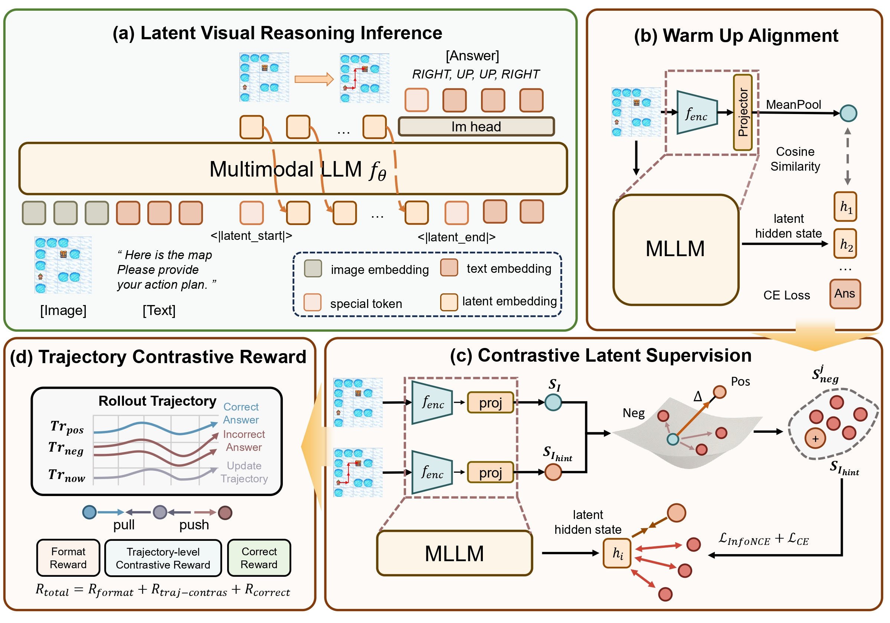

	<h1 align="center">📄CoLVR: Enhancing Exploratory Latent Visual Reasoning via Contrastive Optimization </h1>
	

	

    

      <!---<b>Ziyang Ding, Linjian Meng, Yiming Wu, Yuhan Li, Yuhao Liu, Zhen Zhao†</b>--->
      

        <a href="https://scholar.google.com/citations?user=SuFIjWQAAAAJ&hl=zh-CN/">Ziyang Ding</a>,
        <a href="https://menglinjian.github.io//">Linjian Meng</a>,
        <a href="https://sites.google.com/site/yimingwu0/home/">Yiming Wu</a>,
        <a href="https://github.com/YuhanLeeeee">Yuhan Li</a>,
        <a href="https://yiqian7a.github.io/">Yuhao Liu</a>,
        <a href="http://zhaozhen.me/">Zhen Zhao†</a>,
      

    

    

        
        
        
        

    

we propose **CoLVR** (**C**ontrastive **O**ptimization for **L**atent **V**isual **R**easoning), a latent contrastive training framework toward more flexible and exploratory visual reasoning. CoLVR optimizes relative contrastive relationships among latent visual states, thereby preserving the freedom of latent exploration while still providing task-relevant supervision.

